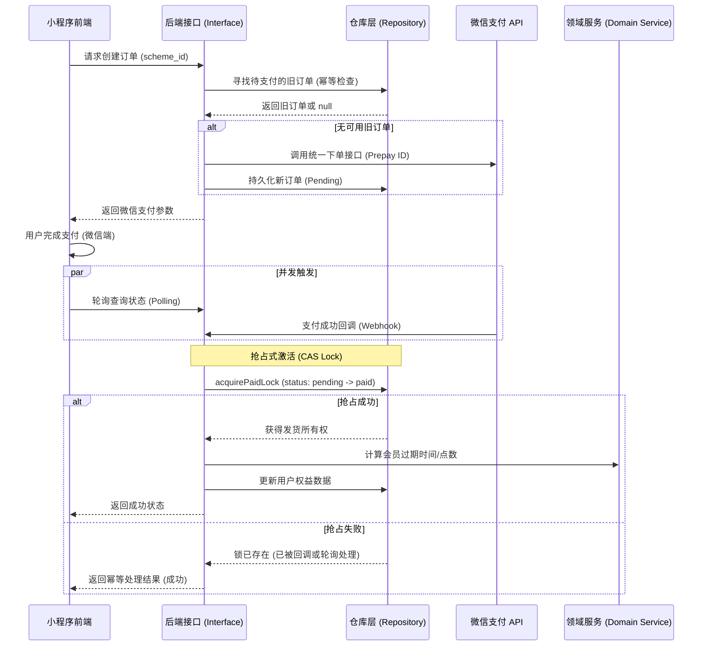

# 支付与会员系统架构设计文档

本文档详细描述了 `puppet-resume` 支付与会员系统的核心设计架构。该系统采用分层架构设计，重点解决了分布式环境下的支付状态一致性、并发安全及业务幂等性。

---

## 1. 架构总览 (System Layers)

系统采用 **Service-Repository** 模式，将业务逻辑与数据持久化完全解耦。

| 层级 | 职责 | 核心组件 |
| :--- | :--- | :--- |
| **Interface (Controller)** | 接口入口，负责请求校验、协议转换 | `createOrder.ts`, `checkOrderStatus.ts`, `payCallback.ts` |
| **Application Service** | 业务编排层，负责跨实体的复杂流程流转 | `activateMembershipByOrder` (Application level) |
| **Domain Service** | 核心业务规则逻辑层，纯逻辑实现 | `MembershipDomainService` |
| **Repository Layer** | 数据访问层，隔离底层 DB 操作 | `OrderRepository`, `UserRepository`, `SchemeRepository` |

---

## 2. 核心状态流转图

系统的核心价值在于确保从“用户下单”到“权益发放”的过程中，状态转换是单向且不可逆的。



---

## 3. 并发安全机制：CAS (Compare And Swap)

为了防止在高并发场景（如微信 Webhook 的重试机制与前端轮询同时触发）下导致的权益超发（双倍积分或双倍时长），系统在数据库层面实现了乐观锁机制。

### 实现逻辑：
在更新订单状态时，强制校验当前状态必须为 `pending`。

```typescript
// 伪代码参考 (OrderRepository)
const result = await db.collection('orders').findOneAndUpdate(
    { 
        _id: orderId, 
        status: 'pending'  // 条件检查
    },
    { 
        $set: { status: 'paid', activated: true } // 原子更新
    }
);
```

*   **成功**：说明当前进程是第一个抢到处理权的，继续执行加积分/加时长的业务逻辑。
*   **失败**：说明订单已被处理，当前进程不再执行后续发货逻辑，直接返回已处理结果（幂等性）。

---

## 4. 业务规则解耦 (Domain Logic)

会员的计算逻辑（如：续费是顺延还是重置？升级如何补差价？）均封装在 `MembershipDomainService` 中。

*   **纯函数设计**：计算逻辑不直接依赖数据库连接，仅接受当前用户信息和目标方案信息。
*   **同构逻辑**：订单创建前的试算（`calculatePrice`）和支付后的权益发放（`activateMembershipByOrder`）使用同一套逻辑，确保价格和最终获得的权益完全对齐。

---

## 5. 异常处理与鲁棒性

*   **远程核实**：在本地订单状态不明确时，后端会自动调用微信支付 `queryOrder` 接口。如果微信侧已经支付，系统会自动触发补单激活流程。
*   **双重校验**：不仅校验状态字段，还会在发货前二次检查用户实体状态。
*   **日志存证**：核心状态转换点均有详细的 `console.log`（建议未来升级为结构化日志），便于快速追踪线上订单故障。
