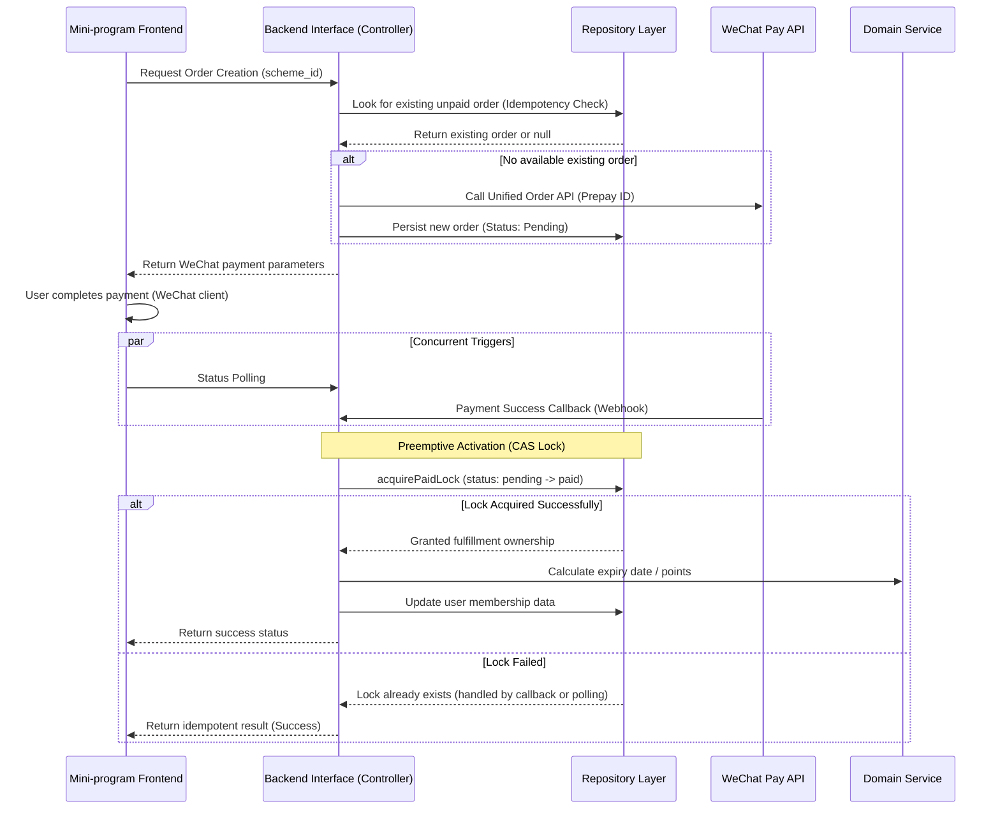

# Payment & Membership System Architecture Design

This document details the core architectural design of the `puppet-resume` payment and membership system. The system employs a layered architecture, focusing on payment consistency, concurrency safety, and business idempotency in a distributed environment.

---

## 1. Architectural Overview (System Layers)

The system follows the **Service-Repository** pattern, completely decoupling business logic from data persistence.

| Layer | Responsibility | Core Components |
| :--- | :--- | :--- |
| **Interface (Controller)** | Entry point, handles request validation and protocol conversion. | `createOrder.ts`, `checkOrderStatus.ts`, `payCallback.ts` |
| **Application Service** | Orchestration layer, handles complex workflows across entities. | `activateMembershipByOrder` (Application level) |
| **Domain Service** | Pure business rules and logic layer. | `MembershipDomainService` |
| **Repository Layer** | Data Access Layer (DAL), isolating low-level DB operations. | `OrderRepository`, `UserRepository`, `SchemeRepository` |

---

## 2. Core State Transition Diagram

The core value of the system is ensuring that the transition from "Order Creation" to "Benefit Fulfillment" is unidirectional and irreversible.



---

## 3. Concurrency Safety: CAS (Compare And Swap)

To prevent double-fulfillment (e.g., duplicate points or duration) in high-concurrency scenarios—such as when a WeChat Webhook retry and a frontend poll occur simultaneously—the system implements an optimistic locking mechanism at the database level.

### Implementation Logic:
When updating the order status, the system enforces a check that the current status must be `pending`.

```typescript
// Pseudocode (OrderRepository)
const result = await db.collection('orders').findOneAndUpdate(
    { 
        _id: orderId, 
        status: 'pending'  // Verification condition
    },
    { 
        $set: { status: 'paid', activated: true } // Atomic update
    }
);
```

*   **Success**: The current process is the "winner" and proceeds with the fulfillment logic.
*   **Failure**: The order has already been processed; the current process stops to avoid duplicate fulfillment (Idempotency).

---

## 4. Business Logic Decoupling (Domain Logic)

Membership calculation rules (e.g., whether a renewal extends or resets the date, how upgrade deductions work) are encapsulated within the `MembershipDomainService`.

*   **Pure Function Design**: Calculation logic does not depend on DB connections directly; it only accepts User and Scheme entities as input.
*   **Isomorphic Logic**: The same logic is used for pre-order price estimation (`calculatePrice`) and post-payment fulfillment (`activateMembershipByOrder`), ensuring consistency between what the user sees and what they receive.

---

## 5. Error Handling & Robustness

*   **Remote Verification**: If the local order status is ambiguous, the backend calls the WeChat `queryOrder` API. If WeChat confirms payment, the system automatically triggers the "Self-Healing" fulfillment flow.
*   **Double Check**: The system validates both the state transition and the user entity's current state before delivery.
*   **Audit Trail**: Critical state transitions are logged with detailed context to allow for rapid troubleshooting of production order issues.
