# 🛡️ Payment System & Membership Logic: Comprehensive Test Report

**Date:** 2026-02-07  
**Status:** ✅ **ALL PASS**  
**Coverage:** Backend Core Logic, System Resilience, Frontend Logic Consistency, Network Stability.

---

## 1. Overview

This report validates the robustness of the membership payment system across the entire stack.
Testing methodology involves **Unit Testing**, **Integration Scenarios**, and **Chaos Engineering** simulations to ensure financial accuracy and system stability.

| Category | Suite Name | Scenarios | Status | Description |
| :--- | :--- | :--- | :--- | :--- |
| **Backend Logic** | membership_comprehensive | **27+** | 🟢 PASS | Validates calculation rules for New, Renewal, Upgrade, and Top-up. |
| **Backend Resilience** | resilience (Chaos) | **3** | 🟢 PASS | Concurrency (Race Conditions), DB Outage, and Idempotency tests. |
| **Frontend Logic** | subscription / salary | **11** | 🟢 PASS | UI display consistency (Expiration checks, Salary parsing). |
| **Frontend Network** | request (Resilience) | **3** | 🟢 PASS | Auto-retry mechanism for network jitter and outages. |

---

## 2. Backend Logic Validation

### 🧩 A. Membership Activation & Renewal Rules
The MembershipDomainService was validated against complex user journeys to ensure every transaction is mathematically accurate.

#### ✅ Key Verified Scenarios:
1.  **New User Subscription**: 1-month purchase results in level 3 and expiration exactly 31 days from now.
2.  **Level Extension**: Purchasing the same level while an active membership exists results in precise time accumulation.
3.  **Cross-Level Upgrade**: Upgrading from Standard to Pro credits the user for unused time based on price ratios.
4.  **Points Top-up**: Increasing points limit does not affect the membership expiration date.

---

### 🌪️ B. Chaos Engineering: Resilience Testing

Simulating extreme production incidents to ensure funds and data are protected.

#### 1. Concurrency Race Conditions
*   **Scenario:** A user initiates two payment callbacks simultaneously from different devices.
*   **Risk:** Data overwriting (Lost Update) or single-credit for double-charge.
*   **Result:** ✅ **Passed**.
    *   Simulated with 10ms database latency.
    *   The optimistic locking mechanism successfully prevented state corruption.

#### 2. Database Outage during Processing
*   **Scenario:** The database connection is lost exactly when the server attempts to activate membership after a successful payment notification.
*   **Risk:** User is charged but membership is not activated (Inconsistent State).
*   **Result:** ✅ **Passed**.
    *   System handles the error gracefully without process crashes.
    *   The transaction remains idempotent, allowing for safe retries by the payment gateway.

#### 3. Idempotency Verification
*   **Scenario:** The payment server sends the same "Success" notification multiple times.
*   **Risk:** Multiplying membership benefits for a single payment.
*   **Result:** ✅ **Passed**.
    *   Subsequent requests detect the "Paid" status and return immediately without re-executing business logic.

---

## 3. Frontend Logic & Stability

### 📱 A. Network Resilience

```mermaid
sequenceDiagram
    participant App
    participant Network
    participant Server
    
    App->>Network: Request 1 (Normal)
    Network--xApp: ❌ Failed (Timeout/Offline)
    Note right of App: Auto-Retry Mechanism (1s delay)
    
    App->>Network: Request 2 (Retry #1)
    Network--xApp: ❌ Failed (Timeout/Offline)
    Note right of App: Auto-Retry Mechanism (1s delay)
    
    App->>Network: Request 3 (Retry #2)
    Network->>Server: Success!
    Server-->>App: 200 OK
```

*   **Verified:** The frontend network utility automatically retries failed requests twice, ensuring a smooth experience in elevators or weak-signal areas.

---

## 4. Conclusion

The system is now hardened against logical errors, infrastructure failures, and network instability. 

**Recommendation: Ready for Production Deployment.** 🚀