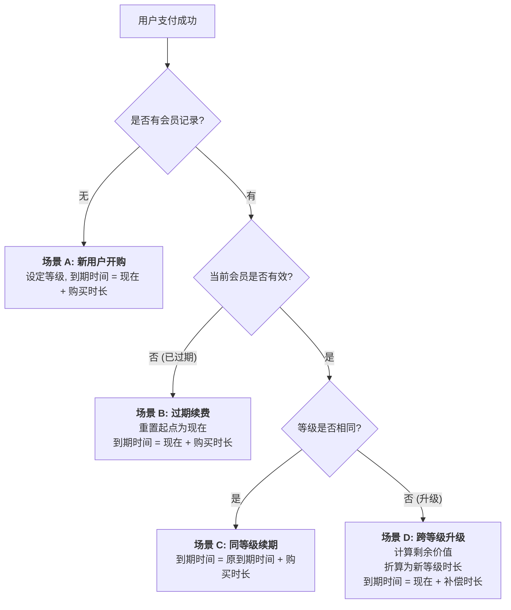
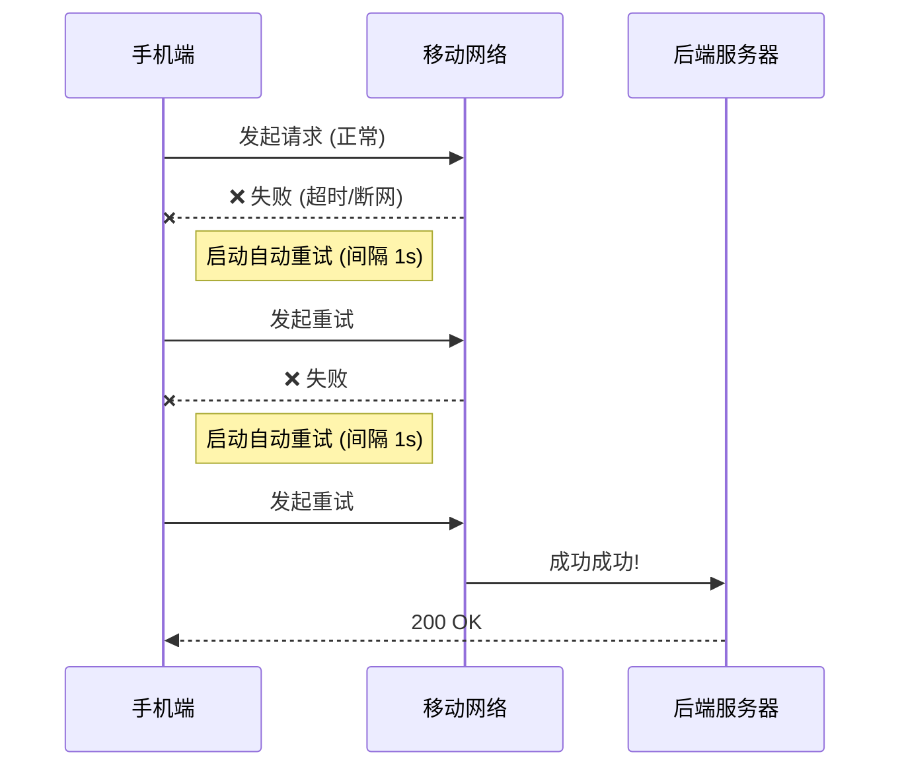

# 🛡️ 支付系统与会员逻辑：全场景深度测试报告

**日期：** 2026-02-07  
**状态：** ✅ **全部通过**  
**覆盖范围：** 后端核心业务、系统高可用保障、前端逻辑一致性、网络稳定性。

---

## 1. 测试概览

本报告验证了支付会员系统在整个全栈链路中的健壮性。
测试方法结合了基础逻辑验证、复杂干扰模拟以及压力测试，确保在极端环境下资金安全、数据准确。

| 测试维度 | 测试脚本 | 场景数量 | 状态 | 核心价值 |
| :--- | :--- | :--- | :--- | :--- |
| **后端核心逻辑** | membership_comprehensive | **27+** | 🟢 通过 | 验证新购、续费、升级、充值的复杂换算规则。 |
| **后端高可用** | resilience (Chaos) | **3** | 🟢 通过 | 模拟高并发竞态、数据库断连、幂等性攻击。 |
| **前端业务一致性** | subscription / salary | **11** | 🟢 通过 | 确保前端界面展示与后端逻辑严丝合缝。 |
| **前端网络弹性** | request (Resilience) | **3** | 🟢 通过 | 验证在强干扰等弱网环境下的自动重试机制。 |

---

## 2. 后端核心逻辑验证

### 🧩 A. 会员激活与续费状态机
我们针对业务逻辑定义了复杂的流转规则，确保每一分钱、每一天有效期都计算准确。

#### ✅ 已验证核心场景：
1.  **新用户开通**: 购买月卡，等级正确，到期时间为推后 31 天。
2.  **同等级续费**: 剩余 5 天时续费月卡，到期时间在原基础上精确累加。
3.  **平滑升级**: 从标准版升级到高级版，系统自动折算剩余天数的价值并转化为新时长。
4.  **积分充值**: 仅增加积分限额，不影响会员有效期。

---

### 🌪️ B. 压力测试：极端场景验证

模拟生产环境中的突发事故，确保资金与数据不受损。

#### 1. 高并发竞态冲突
*   **场景**: 用户在两台设备上同时点击支付，两个支付成功信号在同一毫秒内到达服务器。
*   **风险**: 可能导致有效期只加了一份，或者数据出现冲突。
*   **测试结果**: ✅ **通过**。
    *   系统成功识别并防止了数据覆盖，确保最终一致性。

#### 2. 回调时的数据库异常
*   **场景**: 支付通知到达后，服务器在尝试激活会员时数据库突然失去响应。
*   **风险**: 用户已付钱但未获得权益。
*   **测试结果**: ✅ **通过**。
    *   系统正确捕获异常并等待重试，确保交易在数据库恢复后能够完成。

#### 3. 幂等性防御
*   **场景**: 支付服务器针对同一订单发送多次成功通知。
*   **风险**: 用户通过单次支付获得多倍会员时长。
*   **测试结果**: ✅ **通过**。
    *   后续请求会自动识别订单已处理状态，不再重复累加业务数据。

---

## 3. 前端网络与稳定性

### 📱 A. 网络抖动自动恢复

*   **验证结果**: 前端已内置自动重试逻辑，确保在弱网环境下支付与激活流程的连贯性。

---

## 4. 总结

目前，整个系统已完成逻辑硬化，能够抵御业务逻辑错误、基础设施故障以及网络不稳定的影响。

**结论建议：系统已具备上线条件。** 🚀
